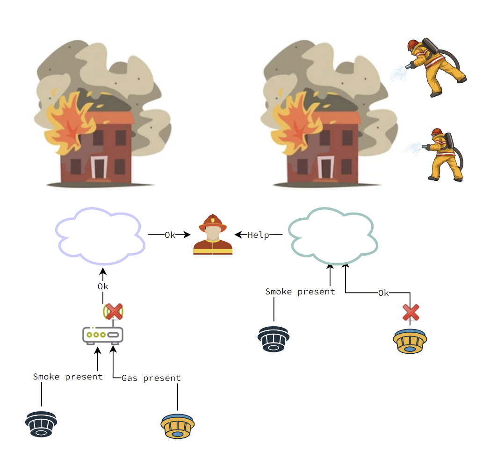

# Secure IoT Solution for Office Building Monitoring

**Video demo**

## Quick Links

## Table of contents

- [Secure IoT Solution for Office Building Monitoring](#secure-iot-solution-for-office-building-monitoring)
  - [Quick Links](#quick-links)
  - [Table of contents](#table-of-contents)
  - [Introduction](#introduction)
  - [Hardware used](#hardware-used)
  - [General security architecture](#general-security-architecture)

## Introduction

The purpose of this project is designing a low-powered IoT solution which enforces entity attestation and
securely transmits data into the cloud, performing edge Machine Learning and
issuing blockchain transactions.

## Hardware used

- ESP32 Development Board
- DHT11 Temperature and Humidity Sensor
- SW-420 Vibration
- MQ-2 Gas Sensor

## General security architecture

The architecture used for this project largely resembles DAVE-2 architecture developed by nVidia as can be seen in [this paper](https://developer.nvidia.com/blog/deep-learning-self-driving-cars/).

Since the input is different from the original paper, alterations were made to that layer to better accommodate the hardware on hand.
The live image is 3 channels deep with a resolution of 1280x720, which is then scaled down using OpenCV2's resize function to 320x180. This is done in order to reduce the size of the neural network which greatly speeds up the training and the inference.
Moving on, the architecture is the same, having the convolutional layers activated by ReLU functions and the Dense layers being liner. The output layer has 3 neurons representing the directions the car can take next (e.g. left, right, forward), being soft-max activated in order to get a probability distribution over predicted output classes.
