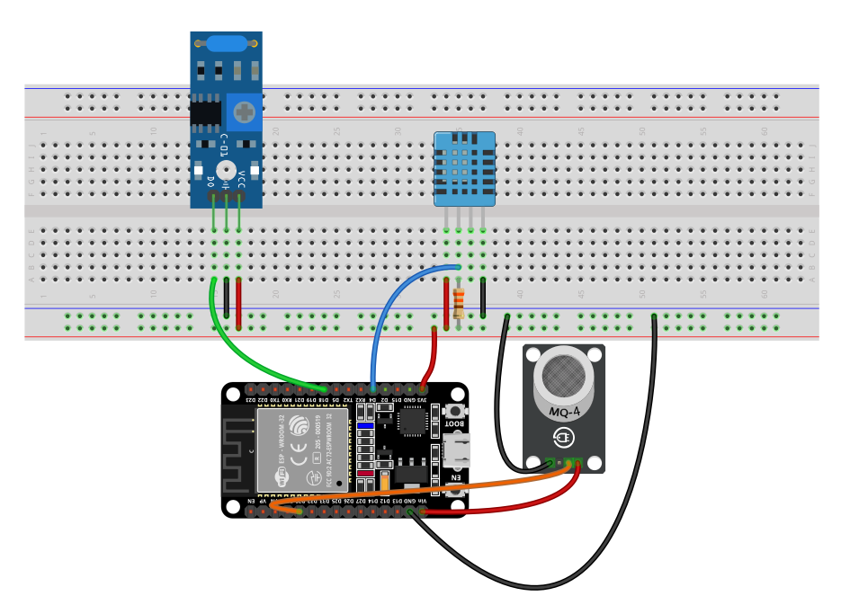
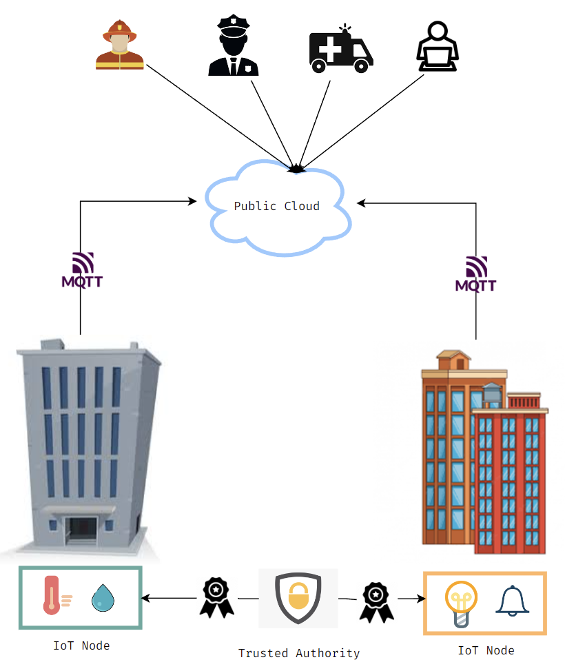

# Secure IoT Solution for Office Building Monitoring

## Quick Links

- [Documentation](https://github.com/andreiczc/dissertation/blob/master/Dissertation.pdf)
- [Presentation](https://github.com/andreiczc/dissertation/blob/master/Presentation.pdf)
- [IoT Node Source Code](https://github.com/andreiczc/dissertation/tree/master/esp_secure_node)
- [Spring Boot Microservices Source Code](https://github.com/andreiczc/dissertation/tree/master/cloudapps)

## Video demo

## Table of Contents

- [Introduction](#introduction)
- [Hardware used](#hardware-used)
- [General architecture](#general-architecture)
  
## Introduction

The purpose of this project is designing a low-powered IoT solution which enforces entity attestation and
securely transmits data into the cloud, performing edge Machine Learning and
issuing blockchain transactions.

## Hardware used

- ESP32 Development Board
- DHT11 Temperature and Humidity Sensor
- SW-420 Vibration
- MQ-2 Gas Sensor

## General architecture

The designed solution proposes a Directly Connected Architecture which features End-to-End encryption. Besides that, an attestation process has been implemented which verifies the origin of the node using Public Key Cryptography. This process features mutual authentication, session key establishment and Instance ID allocation. \
The data from the sensors is transmitted via MQTT in TLS-PSK mode, which can then be collected by any interested party which possesses the required key-pair, since mutual authentication is also enabled at broker level. \
This solution includes a MQTT Client which upon collection will send it via HTTPS call to the Cloud Gateway in order to be persisted in a MySQL database. \
The data can be queried only by authorized users, the authentication being done through JWT.
